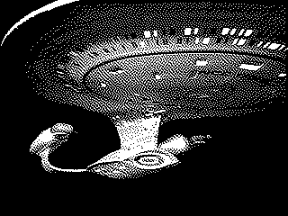
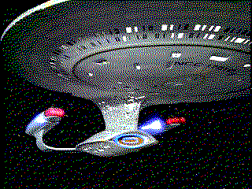

# jquery.retroimage
Apply fun retro-computing-looking dithers to images.

## Usage
```javascript
// by default, dithers to 1-bit monochrome using flyod-steinberg diffusion
$('img').retroimage();

// 216 color "web safe" palette
$('img').retroimage(
  shades: 6, // 6x6x6 = 216
  color: true
);
```

## Installation
_TODO_

## Examples
Options | Image
:-----:|:-----:
_original image_ | 
`{kernel:'atkinson'}` | 
`{shades:1,color:true}` | 
`{shades:6,color:true}` | 

## Options
### kernel
*default: floydSteinberg*

Sets the kernel used for [Error diffusion](http://en.wikipedia.org/wiki/Error_diffusion).

#### Example
```javascript
$('img').retroimage({
  kernel: 'floydSteinberg'
});
```
#### Parameters
* none
* oneDimensional
* twoDimensional
* floydSteinberg
* jarvisJudiceNinke
* atkinson

### shades
*default: 1*

The number of shades to use for each color plane. May be an integer between 1 and 256 inclusive.

#### Example
```javascript
$('img').retroimage({
  shades: 42
});
```

### color
*default: false*

If true, dither the three color planes separately, and re-combine to make a color image. If false, convert the image to greyscale, and then dither.

#### Example
```javascript
$('img').retroimage({
  color: true
});
```

## Implementation Notes
* Dithering is done client-side using [Canvas](https://developer.mozilla.org/en-US/docs/Web/HTML/Canvas).
* The `src` attribute of each image is replaced with a data-uri retrieved from the `toDataURL` method of [HTMLCanvasElement](https://developer.mozilla.org/en-US/docs/Web/API/HTMLCanvasElement).
* Only error-diffusion style dithering is currently supported

## License
MIT
